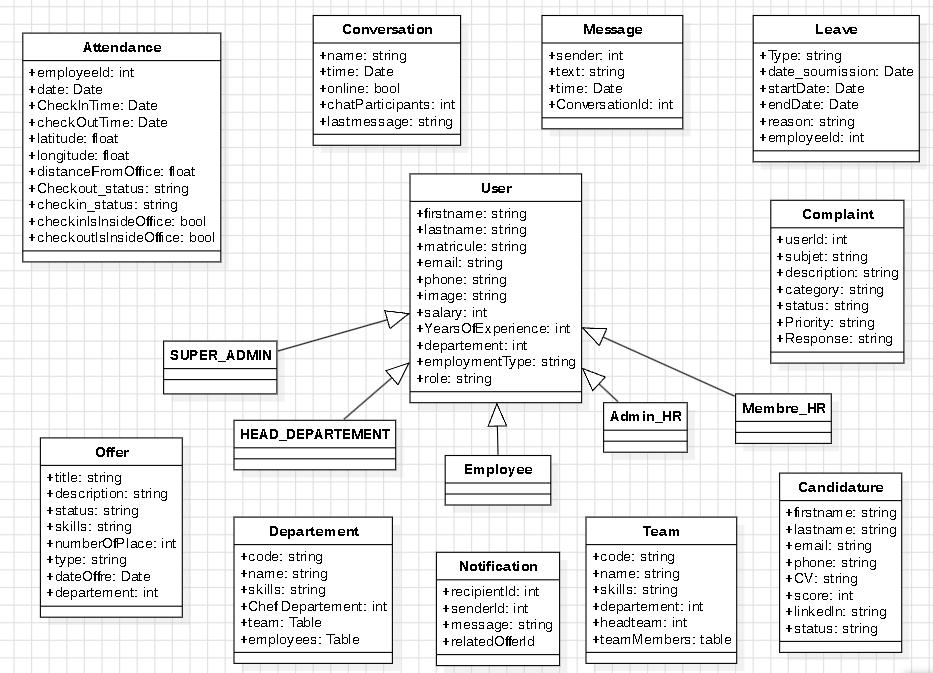
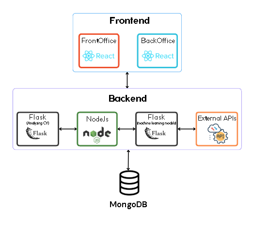

# HR Management Web Application  
**Streamline Talent Acquisition with Modern Efficiency**  
### Overview 🚀  

---

🔍 **Empowering HR Teams**  
- This web-based application is designed to empower HR teams by replacing outdated, manual workflows with a centralized, automated platform.  
- Traditional hiring processes—such as time-consuming CV screening, chaotic tracking of applications across emails and spreadsheets, and error-prone evaluations—are reinvented here.  
- Our solution leverages technology to:  
  ✅ Simplify candidate discovery  
  ⚡ Streamline application management  
  🎯 Enhance hiring accuracy  

✨ **Say goodbye to disorganized spreadsheets** and hello to a smarter, faster, and more intuitive way to recruit top talent.  

---

📚 **Academic Context**  
- This project was developed as part of the coursework for **CS503 - Full-Stack Development**  
  at [Esprit School of Engineering University](https://esprit.tn).  
- Explores HR Management tasks with a focus on:  
  🖥️ Responsive design  
  🤝 Collaborative functionality  

---  
## Table of Contents  
- [1. Architecture](#1-architecture)  
  - [1.1 Class Diagram](#11-class-diagram)  
  - [1.2 Application Architecture](#12-application-architecture)  
- [2. Frontend](#2-frontend)  
  - [2.1 Backoffice](#21-backoffice)  
  - [2.2 Frontoffice](#22-frontoffice)  
- [3. Backend](#3-backend)  
  - [3.1 Node.js](#31-nodejs)  
  - [3.2 External APIs](#32-external-apis)  
  - [3.3 Flask](#33-Flask)
- [4. Getting Started](#4-Getting-Started)
- [5. Acknowledgments](#5-Acknowledgments)
---  

## 1. Architecture  
- QuickHR A full-stack task management application built with the MERN stack.
### 1.1 Class Diagram  


### 1.2 Application Architecture  


#### Frontend 🖥️  
🏗️ **Component-Based Architecture**  
- Divided into two distinct interfaces:  
  | Interface       | Purpose                                                       |  
  |-----------------|---------------------------------------------------------------|  
  | 🏢 **Backoffice** | For HR teams to manage candidates, workflows, and analytics |  
  | 🌐 **Frontoffice**| For candidates to apply and view available offers           |  
- 🧩 **Modular & Reusable Components** ensure maintainability and scalability.  

---
#### Backend #### 
-Designed with a layered architecture (controllers, services, middleware), it uses an API Gateway to orchestrate communication with external services. 
#### Database #### 
-Data is managed via an ODM (e.g., Mongoose) to enforce schemas, validations, and document relationships. Services: Core features like resume screening or facial analysis are handled by integrated models, while third-party tools (Zoom, SendGrid, etc.) are accessed via HTTP calls for functionalities like video interviews or email automation.
## 2. Frontend  
### 2.1 BackOffice
**A centralized, AI-powered platform for HR teams to streamline operations, manage workflows, and optimize workforce decisions.**  

#### 🧑💼 Candidate & Employee Management  
- **Candidate Pipeline**: Track applicants across stages (screening → interviews → onboarding), add notes, and collaborate with hiring teams.  
- **Employee Profiles**: Centralize employee data, including contracts, skills, performance reviews, and career progression.  
- **Team Structuring**: Visualize and modify team hierarchies, assign roles, and manage permissions.  

#### 💼 HR Workflow Automation  
- **Offer & Salary Tools**: Generate employment contracts, adjust salary bands, and manage bonuses/races with compliance checks.  
- **Leave Management**: Approve/reject time-off requests, track balances (vacation, sick days), and sync with calendars.  
- **Attendance Tracking**: Integrate with biometric systems or digital check-ins for real-time attendance monitoring.  

#### 📊 Analytics & Reporting  
- **Custom Dashboards**: Visualize metrics like turnover rates, hiring costs, team productivity, and diversity stats.  
- **Complaint Resolution**: Log, prioritize, and track employee grievances with automated escalation protocols.  
- **Compliance Alerts**: Flag policy violations (e.g., overtime limits) or documentation gaps.  

### 2.2 Frontoffice  
**A streamlined, intuitive hub for job seekers to explore opportunities and manage applications.**

#### 🔍 Dynamic Job Search  
- **Smart Filters**: Narrow down openings by *job type* (full-time, contract, remote), *required skills*, location, seniority, or industry.  
- **Keyword Optimization**: Search by role titles, tools (e.g., "Python," "React"), or company names for precision.  

#### 📋 Detailed Job Listings  
- **Comprehensive Preview**: Each role displays key details:  
  - Responsibilities & qualifications  
  - Salary ranges & benefits  
  - Company culture insights  
  - Application deadlines  

## 3. Backend 💻  

---

### 3.1 Node.js 🟢  
- The Node.js backend acts as the main server, using Express.js to manage API requests.  
- It handles user authentication (like login/logout), connects to MongoDB to store and retrieve data (e.g., candidate profiles, job listings), and communicates with external tools (e.g., email services) and the CV-screening Flask server to process tasks.  

---

### 3.2 External APIs 🌐  
The app uses external services for advanced features:  

| Service         | Purpose                                               |  
|-----------------|-------------------------------------------------------|  
| 🧠 **Gemini**   | Analyzes resumes using AI.                           |  
| 📈 **Adzuna**   | Provides job market data.                            |  
| 📧 **SendGrid** | Sends automated emails (interview invites, updates). |  
| 🎥 **Zoom**     | Enables video interviews.                            |  
| 🕸️ **Scrapy**   | Gathers salary data from the web.                    |  
| 🤖 **micro1**   | Automated interviews for candidates.                 |  

---

### 3.3 Flask 🐍  
Two Flask servers handle specialized tasks:  

- **CV Screening Server**:  
  🔍 Works with Gemini AI to scan resumes, extract key details (skills, experience), and rank candidates.  

- **ML Models Server**:  
  📊 Predicts salaries for job roles, identifies employees at risk of leaving, and suggests training workshops based on HR data.  

🔗 **Note**: Both servers run separately but connect to the Node.js backend when needed.  

## 4. Getting Started  

### Prerequisites  
- **Node.js** (v18+) and **npm**  
- **Python** (3.8+) and **pip**  

---

### Installation & Running  

1. **Clone the Repository**  
   ```bash  
   git clone [https://github.com/your-username/hr-management-app.git](https://github.com/HOUDA-18/HR-Mangement.git)  
   cd HR-Mangement
   ```  

2. **Run the Frontend**  
   - **Backoffice (Admin Interface)**:  
     ```bash  
     cd backoffice  
     npm install    # Install dependencies  
     npm start     # Runs at http://localhost:3000  
     ```  
   - **Frontoffice (Candidate Interface)**:  
     ```bash  
     cd frontoffice  
     npm install  
     npm start     # Runs at http://localhost:3001  
     ```  

3. **Run the Backend Flask Servers**  
   - **CV Screening Server**:  
     ```bash  
     cd CvAnalyze  
     pip install -r requirements.txt  # Install Python packages  
     python api.py                  # Runs at http://localhost:5000  
     ```  
   - **Salary/ML Prediction Server**:  
     ```bash  
     cd backend/SalaryML  
     pip install -r requirements.txt  
     python api.py                  # Runs at http://localhost:5001  
     ```  

4. **Access the App**  
   - Open in your browser:  
     - **HR Backoffice**: `http://localhost:3000`  
     - **Candidate Frontoffice**: `http://localhost:3001`  

⚠️ **Note**:  
- Ensure all services (frontend, Flask servers) are running **simultaneously**.  
- Adjust ports (e.g., `3000`, `5000`) if they’re already in use on your machine.  
## 5. Acknowledgments
This project was completed under the guidance of [Professor Badiaa Bouhdid](https://www.linkedin.com/in/badia-bouhdid-a12925100/) at Esprit School of Engineering. 
